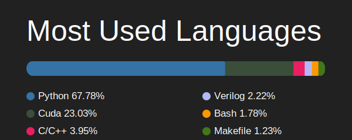

# Hi there 👋

- 🎓 On-going learning for Azure AI development.
- 🔭 Working on Industrial AI, Data Science, and AI Accelerators.
- 🌱 Learning more about ML everyday.
- 🤔 I’m looking for help with AI projects.
- 💼 Check out my previous papers on [Google Scholar](https://scholar.google.com/citations?user=0kupfkYAAAAJ&hl=en).
- 💬 Ask me about anything related to Machine Learning, Python Development, and Accelerator Design.
- ⚡ Fun fact: I love exploring new technologies!

## Connect with me

---

<table style="width: 100%; border-collapse: collapse; border: none;">
  <tr>
    <td style="width: 50%; padding: 0; border: none;">
      
    </td>
    <td style="width: 50%; padding: 0; border: none;">
      
    </td>
  </tr>
</table>

Feel free to reach out!
